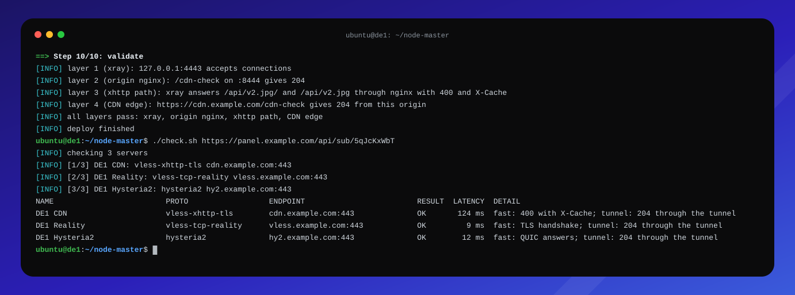

<p align="center"></p>

<h1 align="center">node-master</h1>

<p align="center"><b>Нода Remnawave за Timeweb CDN одной командой.</b></p>

<p align="center"></p>

<p align="center">
  <a href="#что-нужно"></a>
  <a href="#что-нужно"></a>
  <a href="#подводные-камни"></a>
  <a href="#что-нужно"></a>
  <a href="#разработка"></a>
</p>

<p align="center">
  <a href="#что-делает">Что делает</a> ·
  <a href="#установка">Установка</a> ·
  <a href="#шаги-в-панели">Панель</a> ·
  <a href="#проверка">Проверка</a> ·
  <a href="#чекер-подписки">Чекер</a> ·
  <a href="#подводные-камни">Подводные камни</a>
</p>

---

## Что делает

`deploy.sh` делает из сервера ноду Remnawave, к которой клиенты подключаются через Timeweb CDN, а напрямую — по Reality и Hysteria2:

1. **nginx для CDN.** Слушает `:8444`, принимает соединения от CDN и передаёт xhttp в xray на `127.0.0.1:4443`. Путь без слэша на конце, который присылает Timeweb, тоже доходит до xray, остальные запросы получают 403.
2. **Сертификаты.** Выпускает Let's Encrypt по HTTP-01 для `VLESS_DOMAIN` и `HY2_DOMAIN` и продлевает их через `certbot.timer`. Порт 80 открыт только на время выпуска и продления. После продления перезагружает nginx, а после продления сертификата Hysteria2 перезапускает ноду.
3. **Ядро.** Очереди соединений, BBR, диапазон портов, лимит открытых файлов, резерв портов 4443 и 8444 — против ошибок 503 под нагрузкой.
4. **Конфиги для панели.** Кладёт в `out/remnawave/` профиль ноды (Reality, xhttp для CDN, Hysteria2), шаблон подписки и `extra` для CDN-хоста и проводит по шагам в панели и в Timeweb.
5. **Нода.** Берёт `SECRET_KEY`, который показывает панель, ставит Docker, если его нет, и запускает контейнер `remnanode`.
6. **Проверка.** Проходит цепочку xray → nginx → путь xhttp → CDN и на первом сбое пишет, что исправить.

`check.sh` проверяет подписку: отвечает ли каждый сервер и идёт ли через него трафик.

```
Клиент --VLESS xhttp (TLS, 443)--> Timeweb CDN --HTTPS--> nginx :8444 --HTTP--> xray 127.0.0.1:4443
Клиент --VLESS Reality (TCP, 443)---------------------------------------------> xray :443
Клиент --Hysteria2 (UDP, 443)-------------------------------------------------> xray :443
```

Конфиг xray на ноде ведёт панель: скрипт его не пишет, а готовит файлы, которые вы вставляете в панель.

## Что нужно

| | |
|---|---|
| **Панель** | Remnawave уже работает. Ноду заранее не создавайте: её создают с профилем, который выдаст скрипт |
| **Сервер** | Ubuntu 22.04/24.04/26.04 или Debian 12, root |
| **Домены** | `VLESS_DOMAIN`: A-запись на сервер, обязателен. `CDN_DOMAIN`: CNAME на технический домен ресурса Timeweb (`*.cdn.twcstorage.ru`). `HY2_DOMAIN`: A-запись на сервер, если нужен Hysteria2 |
| **Порты** | 80/tcp для Let's Encrypt, 8444/tcp для CDN, 443/tcp и 443/udp для Reality и Hysteria2, 2222/tcp для панели |
| **fail2ban** | только джейл `sshd`: HTTP-джейлы банят адреса CDN |

**Ресурс Timeweb CDN:**
- источник: `IP сервера:8444`, HTTPS для источника включён;
- домен раздачи: `CDN_DOMAIN`. Сертификат для него выпустите в панели Timeweb **и привяжите к ресурсу**, применение занимает до 30 минут. Скрипт этот сертификат не выпускает: HTTP-01 не проверит домен, который смотрит на CDN;
- кэширование оставьте включённым: с выключенным, по отчётам, ресурс отвечает 403, а туннель помечен `no-store`, и Timeweb его не кэширует. «Игнорировать заголовки кэширования», «Всегда онлайн» и «Ускорение загрузки больших файлов» не включайте.

## Установка

```sh
git clone https://github.com/MarselNet86/node-master.git && cd node-master && sudo ./deploy.sh
```

Скрипт спросит язык (ru/en) и параметры, дальше работает сам и останавливается только на шагах в панели. Ответы он хранит в `.env` с правами 600: там ключ Reality и `SECRET_KEY` ноды.

- **План без изменений:** `sudo ./deploy.sh --dry-run` печатает настройки и шаги.
- **Повторный запуск безопасен:** ответы из `.env` становятся значениями по умолчанию, неизменённые файлы и действующие сертификаты не трогаются. Ручные правки в `/etc/nginx` затираются, меняйте `templates/`.
- **Без вопросов:** заполните `.env` по [.env.example](.env.example) и запустите `sudo ./deploy.sh </dev/null`. Без `NODE_SECRET_KEY` нода не запустится, и на новом сервере проверка закончится кодом 8: создайте ноду в панели, впишите ключ в `.env` и запустите скрипт снова.

### Уже работающий сервер

CDN добавляется рядом с работающими VLESS Reality и Hysteria2, их инбаунды скрипт не трогает.

- `HY2_DOMAIN` оставьте пустым: скрипт не будет выпускать сертификат Hysteria2 и перезапускать ноду.
- `VLESS_DOMAIN` нужен всё равно, на него выпускается сертификат nginx. Подойдёт любой домен сервера с A-записью.
- Ноду, поставленную вручную, скрипт подхватит: возьмёт `SECRET_KEY` и порт из `/opt/remnanode/docker-compose.yml`, перепишет файл по образцу панели, а старый сохранит как `docker-compose.yml.cdn-deploy-orig`.

> [!WARNING]
> nginx скрипт забирает целиком: `nginx.conf` перезаписывается (копия остаётся в `nginx.conf.cdn-deploy-orig`), `sites-enabled/default` удаляется. Другие сайты не должны слушать `8444` и объявлять `upstream xray_xhttp`, иначе `nginx -t` не пройдёт и скрипт вернёт прежний конфиг с кодом 7.

### Параметры

Подробные комментарии к каждому — в [.env.example](.env.example).

| Переменная | По умолчанию | Что это |
|---|---|---|
| `UI_LANG` | по локали | язык сообщений: `en` или `ru` |
| `VLESS_DOMAIN` | — | домен сервера: сертификат nginx и прямой VLESS |
| `HY2_DOMAIN` | пусто | домен Hysteria2; пусто — профиль без Hysteria2 |
| `CDN_DOMAIN` | — | домен CDN-ресурса |
| `ORIGIN_IP` | определяется сам | IPv4 сервера, источник CDN-ресурса |
| `XHTTP_PORT` | `4443` | локальный порт xhttp-инбаунда |
| `XHTTP_PATH` | `/api/v2.jpg/` | путь xhttp, одинаковый на инбаунде и хосте |
| `NGINX_TLS_PORT` | `8444` | порт nginx для CDN |
| `LE_EMAIL` | пусто | email для Let's Encrypt |
| `NODE_RELOAD_CMD` | `docker restart remnanode` | перезапуск ноды после продления сертификата Hysteria2 |
| `REALITY_SNI` | `www.swiss.com` | сайт, под который маскируется Reality; `-` — профиль без Reality |
| `REALITY_PRIVATE_KEY`, `REALITY_SHORT_ID` | генерируются | ключи Reality: создаются один раз, повторный запуск их не меняет |
| `NODE_NAME` | первая часть `VLESS_DOMAIN` | имя ноды: окончание тегов инбаундов и имя профиля |
| `NODE_PORT`, `NODE_SECRET_KEY` | `2222`, — | из `docker-compose.yml`, который показывает панель |

Порты `XHTTP_PORT` и `NGINX_TLS_PORT` должны отличаться друг от друга и от 443. После смены обновите инбаунд в панели или источник ресурса в Timeweb.

## Шаги в панели

Скрипт печатает их сам и в терминале ждёт Enter после каждого. Клавиша `s` на паузе показывает файл шага. Если файлы с прошлого запуска не изменились, скрипт на шагах не останавливается.

1. **Профиль.** Config Profiles → Create Config Profile, имя — `NODE_NAME` заглавными, вставить `config-profile.json`.
2. **Нода.** Nodes → Management → Create node, адрес — IP сервера, на последнем шаге выбрать профиль из шага 1. Панель покажет `docker-compose.yml`: вставьте в скрипт его `SECRET_KEY` и `NODE_PORT`, и скрипт запустит ноду.
3. **Сквад.** Internal Squads → сквад пользователей → включить новые инбаунды. Без этого пользователи их не получат.
4. **Шаблон подписки.** Templates → Xray JSON → вставить `subscription-xray-json.json`.
5. **Хосты,** по одному на инбаунд, в Advanced каждого — шаблон из шага 4. У CDN-хоста адрес, SNI и host — `CDN_DOMAIN`, путь `XHTTP_PATH`, в `extra` — `host-xhttp-extra.json`.
6. **Ресурс Timeweb,** как в разделе [«Что нужно»](#что-нужно).

Теги инбаундов заканчиваются на `NODE_NAME` (`VLESS-REALITY-DE1`): панель требует уникальных тегов во всех профилях. Если у ноды уже есть свой профиль, добавьте в него только `inbound-xhttp-cdn.json`.

> [!WARNING]
> Поля обфускации xhttp (`xPadding*`, `sessionID*`, `seq*`, `uplink*`, `serverMaxHeaderBytes`) на инбаунде и в `extra` хоста должны совпадать один в один, иначе туннель рвётся именно через CDN. Подробности и тюнинг против 503 — в [remnawave/README.md](remnawave/README.md).

> [!IMPORTANT]
> Hysteria2 читает сертификат из `/etc/letsencrypt` внутри контейнера ноды, поэтому скрипт монтирует туда `/etc/letsencrypt:/etc/letsencrypt:ro`. Если compose-файл ноды ведёте сами, добавьте этот том, иначе xray не запустится.

## Проверка

Последний шаг проверяет цепочку снизу вверх, на первом сбое выходит с кодом 8 и называет причину.

| Слой | Что проверяется | Частые причины сбоя |
|---|---|---|
| **1. xray** | `127.0.0.1:4443` принимает соединения | нода не создана или не получила `SECRET_KEY`; у контейнера нет тома `/etc/letsencrypt`; панель не достучалась до `NODE_PORT`. Скрипт покажет ошибку из лога ноды |
| **2. nginx** | `/cdn-check` на `:8444` отвечает 204 | nginx не запущен или отдаёт чужой сайт |
| **3. путь xhttp** | xray отвечает на `XHTTP_PATH` через nginx | 404: путь или host не совпадают с панелью; 502/504: nginx не достаёт до xray |
| **4. CDN** | `https://CDN_DOMAIN/cdn-check` отвечает 204 от этого сервера | нет CNAME; сертификат не привязан к ресурсу; 502/504: неверный источник или закрыт порт; 451: домен заблокирован |

| Код выхода | Значение |
|---|---|
| `0` | всё готово, проверка прошла |
| `1` | шаг не выполнился, причина в сообщении |
| `2` | неверный или недостающий параметр |
| `3` | нет нужной команды или пакет не установился |
| `4` | нужен root |
| `5` | ОС не поддерживается |
| `6` | не удалось выпустить сертификат |
| `7` | nginx не принял конфиг, прежний восстановлен |
| `8` | не прошёл слой проверки |

## Чекер подписки

```sh
./check.sh 'https://panel.example.com/api/sub/<shortUuid>'
./check.sh --fast 'https://panel.example.com/api/sub/<shortUuid>'   # без туннелей
```

Каждый сервер подписки проверяется дважды: быстрым запросом к нему (xhttp, TLS-рукопожатие, QUIC) и настоящим запросом через локальный xray. Нужны bash 4+, curl, jq и openssl; root не нужен, система не меняется. Настройки: `./check.sh --help`. Коды выхода: `0` — все серверы OK, `1` — есть FAIL или подписка не получена, `2` — неверные аргументы, `3` — не хватает команды.

Для туннелей нужен отдельный xray, по ту же сторону от версии 26.6, что и нода (см. [подводные камни](#подводные-камни)). Без него чекер делает только быстрые проверки.

```sh
v=26.7.28   # версия на ноде: docker exec remnanode rw-core version
case "$(dpkg --print-architecture)" in amd64) a=64 ;; arm64) a=arm64-v8a ;; esac
curl -fsSLo /tmp/xray.zip "https://github.com/XTLS/Xray-core/releases/download/v$v/Xray-linux-$a.zip"
sudo apt-get install -y unzip && sudo unzip -o /tmp/xray.zip xray -d /usr/local/bin
```

Если у пользователя в панели лимит устройств, чекер занимает в нём одно место: он представляется устройством «cdn-deploy check.sh». Для регулярных проверок удобнее пользователь без лимита.

## Подводные камни

- **Версия xray.** В 26.6 поля сессии xhttp переименованы (`sessionPlacement` → `sessionIDPlacement`), файлы в `remnawave/` используют новые имена. Нода и клиенты должны быть по одну сторону от 26.6, иначе каждый запрос получает 400. Этим объясняются отчёты «нода 2.8.1 сломала CDN».
- **Timeweb CDN** пропускает только GET, HEAD и OPTIONS, поэтому uplink идёт в режиме packet-up. По отчётам он отвечает 403 на длинные URL и заголовки, а ресурс без запросов через 7 дней приостанавливается.
- **Подключение мимо CDN:** nginx работает без HTTP/2, поэтому xhttp-клиенту, который ходит на сервер напрямую, нужен ALPN `http/1.1`.

## Разработка

Правила и контракты модулей описаны в [tech.md](tech.md).

```sh
shellcheck deploy.sh check.sh lib/*.sh tests/*.bats
bats tests/
```

Тесты не трогают систему: системные пути уводятся во временный каталог (`CDN_DEPLOY_SYSROOT`), внешние команды заменены заглушками. Тесты гоняются в Docker на всех поддерживаемых ОС, под root и под обычным пользователем.

<p align="center">
  <a href="tech.md">Контракт проекта</a> ·
  <a href="remnawave/README.md">Конфиги для панели</a> ·
  <a href="https://github.com/MarselNet86/node-master/issues/new">Сообщить о проблеме</a>
</p>
